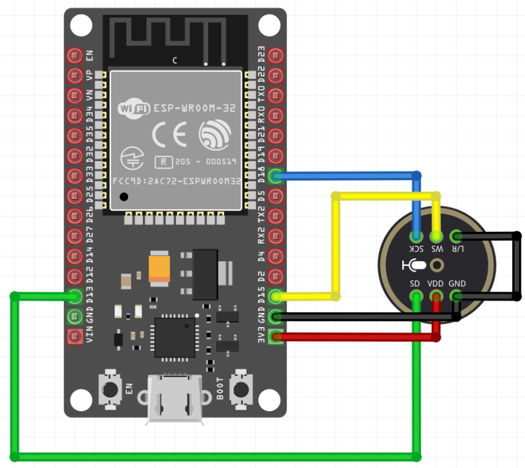
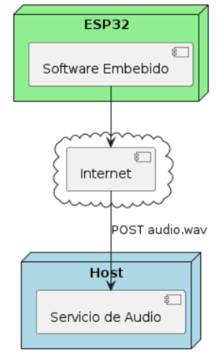
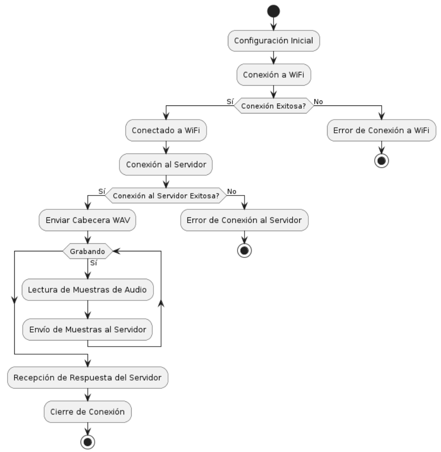

# ESP32 and INMP441 Microphone Audio Capture and Transmission Tutorial

This tutorial guides through capturing audio using an ESP32 with an MEMS INMP441 microphone via the I2S protocol and sending these audio samples to a remote server using WiFi. The audio is captured at a sampling frequency of 16KHz, with a 16-bit resolution, in mono channel format.

## Prerequisites

Ensure you have basic knowledge in electronics, programming with ESP32, and basic experience with Node.js.

## Required Components

- ESP32 Development Board
- INMP441 Microphone with I2S Interface
- Female-to-Female Jumper Wires
- Micro-USB Cable for programming and power supply

## Project Setup

### Cloning the Repository

First, clone the project repository to your local machine. Open a terminal and run:

```bash
git clone https://github.com/alvaro-salazar/esp32-audio-i2s-wav-http.git
cd esp32-audio-i2s-wav-http
```

This repository contains both the embedded system code (ESP32) and the audio reception server code (Node.js).

### Hardware Setup

1. **Connecting the Microphone to ESP32**: Use the provided connection diagram to connect the INMP441 microphone to the ESP32.
2. **Verification**: Check that all connections are correct to prevent any damage.
### Wiring Setup

Connect the INMP441 to the ESP32 with jumper wires according to the diagram provided:



### Project Architecture

This outlines the project's architecture (in Spanish). The strategy involves transmitting data to the audio service directly from the reading buffer as soon as it becomes available. To extend the device's lifespan, this code avoids using Flash memory for data storage.



Activity diagram for the application:


### Preparing the Development Environment

#### For the Node.js (Express) Project

```bash
cd audioService
npm install
```

This command will install all necessary dependencies for the Express server.

#### For the PlatformIO (ESP32) Project

Ensure you have PlatformIO installed in VSCode. Open the ESP32 project folder with VSCode, and PlatformIO should automatically prepare the environment.

### Setting Up the Audio Reception Service

Within the `audioService` folder, locate the `app.js` file. This contains the setup for the Express server prepared to receive audio files.

To start the server, run:

```bash
node app.js
```

Ensure the server is listening on the configured port before proceeding.

### Embedded System Code (ESP32)

Before loading the code onto your ESP32, ensure to:

1. **Update WiFi Credentials**: Modify the code to include your WiFi network's SSID and password.
2. **Specify Server Address**: Ensure the IP address and port in the ESP32 code match your running Express server.

Load the code onto the ESP32 using PlatformIO or the Arduino IDE.

## Running the Project

With the Express server running, restart the ESP32 to begin capturing and sending audio. Check the Express server console to ensure audio data is being received and stored correctly.

## Contributions

If you wish to contribute to this project, consider forking it and submitting your pull requests with improvements or corrections.

## License

This project is distributed under the MIT License. See the `LICENSE` file for more details.
